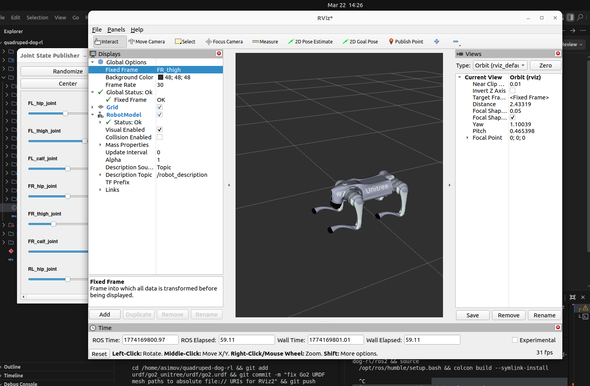

# quadruped-dog-rl

Quadruped robot dog simulation, walking control, and reinforcement learning policy training workspace.

Supports: Unitree Go1/Go2, Boston Dynamics Spot, MIT Mini Cheetah, ANYmal B/C, Mini Pupper.



---

## Repository Structure

```
quadruped-dog-rl/
├── urdf/                    # Robot URDF and mesh files
│   ├── go1_config/          # Unitree Go1
│   ├── go2_unitree/         # Unitree Go2 (with DAE meshes)
│   ├── spot_config/         # Boston Dynamics Spot
│   ├── mini_cheetah_config/ # MIT Mini Cheetah
│   ├── mini_pupper_config/  # Mini Pupper
│   ├── anymal_b_config/     # ANYmal B (ETH Zurich)
│   └── anymal_c_config/     # ANYmal C (ETH Zurich)
├── ros2/                    # ROS2 packages (CHAMP framework, ros2 branch)
│   ├── champ/               # Core locomotion controller
│   ├── champ_base/          # Hardware abstraction layer
│   ├── champ_bringup/       # Launch files
│   ├── champ_config/        # Robot-specific configs
│   ├── champ_description/   # URDF loading
│   ├── champ_gazebo/        # Gazebo simulation
│   ├── champ_navigation/    # Navigation stack
│   ├── champ_teleop/        # Keyboard/joystick teleoperation
│   └── robots/              # Pre-configured robot packages
├── launch/                  # Top-level launch files
│   ├── view_go2.launch.py   # View Go2 URDF in RViz2
│   ├── gazebo_go2.launch.py # Spawn Go2 in Gazebo Garden
│   ├── gazebo_sim.launch.py # Generic Gazebo sim launcher
│   ├── rviz_view.launch.py  # Generic RViz2 viewer
│   └── policy_deploy.launch.py # Deploy trained RL policy
├── scripts/                 # Shell scripts for common tasks
│   ├── train_policy.sh      # Train walking policy
│   ├── play_policy.sh       # Visualize trained policy
│   └── launch_sim.sh        # Launch Gazebo sim
├── training/                # RL policy training (Unitree RL Gym)
│   ├── legged_gym/          # PPO training scripts and environments
│   ├── deploy/              # Policy deployment to real robot
│   └── setup.py
├── description/             # Robot description docs and joint conventions
└── interfaces/              # Custom ROS2 msgs, srvs, actions (placeholder)
```

---

## System Requirements

- Ubuntu 22.04
- ROS2 Humble
- Gazebo Garden (gz-sim7) — already works with `ros_gz_sim`
- Python 3.8+
- NVIDIA GPU with 10GB+ VRAM for RL training

---

## Build ROS2 Packages

```bash
cd ros2
source /opt/ros/humble/setup.bash
colcon build --symlink-install --cmake-args -DBUILD_TESTING=OFF
source install/setup.bash
```

---

## View Go2 in RViz2

```bash
source /opt/ros/humble/setup.bash
ros2 launch launch/view_go2.launch.py
```

Opens RViz2 with the full Go2 mesh and a joint slider GUI to pose the legs.

---

## Spawn Go2 in Gazebo Garden

```bash
source /opt/ros/humble/setup.bash
ros2 launch launch/gazebo_go2.launch.py
```

Starts Gazebo Garden, spawns the Go2, bridges topics to ROS2, and opens RViz2 alongside it.

Send velocity commands:

```bash
ros2 topic pub /cmd_vel geometry_msgs/msg/Twist "{linear: {x: 0.5}}" --once
```

---

## RL Policy Training

Requires Isaac Gym — download from https://developer.nvidia.com/isaac-gym

```bash
cd training
pip install -e .

# Train Go2 walking policy
python legged_gym/scripts/train.py --task=go2 --headless

# Visualize trained policy
python legged_gym/scripts/play.py --task=go2

# Deploy to real robot
cd deploy
python deploy.py --task=go2 --ckpt=<path_to_checkpoint>
```

Or use the helper scripts:

```bash
./scripts/train_policy.sh go2
./scripts/play_policy.sh go2
```

---

## Available Robots

| Robot | URDF Path | RL Task |
|-------|-----------|---------|
| Unitree Go1 | `urdf/go1_config/` | `go1` |
| Unitree Go2 | `urdf/go2_unitree/urdf/go2.urdf` | `go2` |
| Boston Dynamics Spot | `urdf/spot_config/` | — |
| MIT Mini Cheetah | `urdf/mini_cheetah_config/` | — |
| ANYmal B | `urdf/anymal_b_config/` | — |
| ANYmal C | `urdf/anymal_c_config/` | — |
| Mini Pupper | `urdf/mini_pupper_config/` | — |

---

## References

- [CHAMP Framework](https://github.com/chvmp/champ) — ROS2 locomotion controller
- [Unitree RL Gym](https://github.com/unitreerobotics/unitree_rl_gym) — PPO policy training
- [legged_gym (ETH Zurich)](https://github.com/leggedrobotics/legged_gym) — original RL gym
- [Isaac Lab](https://github.com/isaac-sim/IsaacLab) — modern GPU training framework
