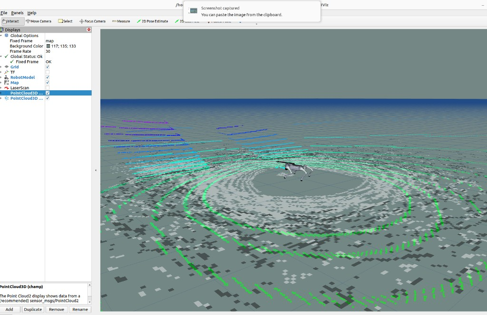
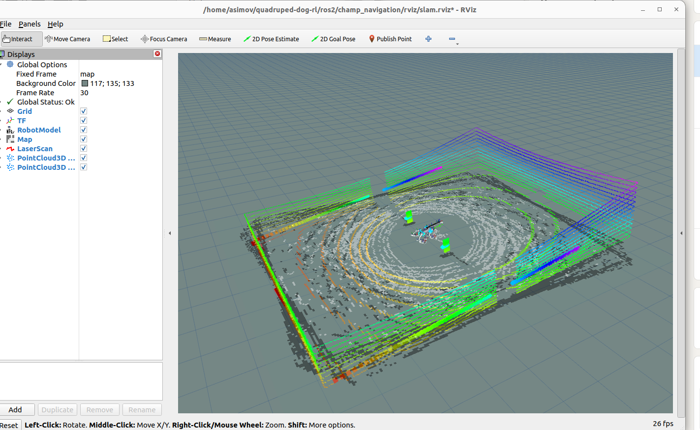

# quadruped-robotics-stack


A ROS2 + Gazebo + MuJoCo workspace for simulating and walking quadruped robots, with three interchangeable locomotion backends and an RL training pipeline built on top.

**What's working right now:**
- **RL locomotion (primary focus)**: a PPO policy trained end-to-end in MuJoCo — no hand-written gait, no IK, just observations in and joint targets out — learns to walk the Go2 from scratch (domain randomization, curriculum, 8-term reward). A second pipeline trains and compares **blind vs. sighted** policies on procedurally randomized rough, multi-terrain ground with scattered obstacles and an 18-point height-scan observation. A third trains **fall recovery** (FR-Net-style get-up from random fallen poses). See [RL Policy Training](#rl-policy-training).
- **Stairs & ledges**: Gazebo + MuJoCo courses (solid stair curriculum, platforms, gaps, hollow open-riser stairs) with one-command CHAMP walk. See [Stairs & ledge worlds](#stairs--ledge-worlds).
- **Go2 model weights**: local Stable-Baselines3 `.zip` walk checkpoints can be resumed and improved in this repo; downloadable Isaac/rsl_rl/Genesis `.pt` files use their upstream stacks. See [Go2 model files](docs/PRETRAINED.md).
- **Research library**: 14 local PDFs on stair climbing, parkour, recovery, and adaptation under [docs/papers/](docs/papers/README.md).
- **[Quad-SDK](https://github.com/robomechanics/quad-sdk) NMPC** drives a real Unitree Go2 to a commanded goal in Gazebo Harmonic — stands up, plans a path, solves NMPC in real time (~20-30ms/solve), and walks at ~0.7 m/s. See [Quad-SDK (NMPC locomotion)](#quad-sdk-nmpc-locomotion--go2-walks) for the full verified trace.
- **CHAMP** kinematic gait engine for quick, dependency-light walking on the generic reference robot.
- **Indoor autonomy**: room world + RTAB-Map 3D SLAM, frontier exploration, obstacle tracking — [docs/DEMOS.md](docs/DEMOS.md).

**Go2 is the only fully working robot** — real URDF, meshes, and both locomotion backends. The `urdf/{go1,spot,mini_cheetah,mini_pupper,anymal_b,anymal_c}_config/` folders are CHAMP gait/joint-layout config stubs carried over from upstream CHAMP examples: no URDF or mesh files are vendored, each references an external `*_description` ROS1(!) package by `$(find ...)` that isn't included in this repo, so none of them spawn as-is. Treat them as a starting point for wiring up a new robot, not as ready-to-run.







---

## Table of Contents
- [Repository Structure](#repository-structure)
- [System Requirements](#system-requirements)
- [Build ROS2 Packages](#build-ros2-packages)
- [Quick Start](#quick-start)
- [CHAMP Locomotion Simulation](#champ-locomotion-simulation)
- [Locomotion Backends](#locomotion-backends)
- [RL Policy Training](#rl-policy-training)
- [Stairs & ledge worlds](#stairs--ledge-worlds)
- [Model policies](#model-policies)
- [Headless IK Controller](#headless-ik-controller-no-rl)
- [Play Trained Policy](#play-trained-policy-opencv-viewer)
- [Keyboard Teleop](#keyboard-teleop-mujoco-with-rl-policy)
- [Deploy Trained Policy in MuJoCo](#deploy-trained-policy-in-mujoco)
- [Available Robots](#available-robots)
- [Manipulator Arm](#manipulator-arm)
- [Intelligence Modules](#intelligence-modules)
- [Roadmap](#roadmap)
- [Additional Docs](#additional-docs)
- [References](#references)

---

## Repository Structure

```
quadruped-robotics-stack/
├── urdf/                    # Robot URDF and mesh files
│   └── go2_unitree/         # Unitree Go2 (with DAE meshes) — fully working
├── ros2/                    # CHAMP + Quad-SDK ROS2 packages
├── launch/                  # Top-level launch files
│   ├── champ_go2_gazebo.launch.py
│   ├── stairs_ledges_go2.launch.py   # CHAMP on stairs or ledges course
│   ├── indoor_autonomy_go2.launch.py # Room + RTAB-Map + frontier explore
│   ├── slam3d_go2.launch.py
│   ├── nav2_go2.launch.py
│   └── …
├── scripts/
│   ├── generate_stairs_ledges.py     # Regenerate stair/ledge SDF + MJCF
│   ├── download_pretrained.py        # Fetch Go2 locomotion/parkour .pt
│   ├── train_stairs.sh               # MuJoCo stairs curriculum train
│   ├── train_policy.sh
│   └── …
├── training/
│   ├── envs/
│   │   ├── go2_gz_world_stairs.sdf   # Easy→mid→hard stairs + descent
│   │   ├── go2_gz_world_ledges.sdf   # Platforms, gaps, hollow stairs
│   │   ├── go2_gz_world_room.sdf     # Indoor autonomy
│   │   ├── go2_gz_world_outdoor.sdf
│   │   ├── go2_stairs_scene.xml      # MuJoCo stairs+ledges course
│   │   └── …
│   ├── terrain/             # Generators + Unitree terrain_tool helpers
│   ├── pretrained/          # Downloaded .pt weights (gitignored); see README
│   │   ├── go2_locomotion/  # flat + rough Isaac PPO
│   │   └── go2_parkour/     # RPL rough / field / visual distill
│   ├── logs/mujoco/         # Local SB3 walk checkpoints (best_model.zip, …)
│   └── …
├── intelligence/            # Gait, perception, navigation, LLM commander
├── docs/
│   ├── images/              # Demo GIFs / SLAM / policy / arm screenshots
│   ├── papers/              # 14 local PDFs (stairs, parkour, recovery)
│   ├── DEMOS.md
│   ├── PRETRAINED.md
│   ├── BENCHMARKS.md
│   ├── TROUBLESHOOTING.md
│   └── PROJECT_GROWTH_PLAN.md
└── …
```

---

## System Requirements

- Ubuntu 22.04
- ROS2 Humble
- Gazebo Harmonic (gz-sim8) — works with `ros_gz_sim`
- Python 3.8+
- NVIDIA GPU with 10GB+ VRAM for RL training

---

## Build ROS2 Packages

```bash
cd ros2
source /opt/ros/humble/setup.bash
colcon build --symlink-install --cmake-args -DBUILD_TESTING=OFF
source install/setup.bash
```

---

## Quick Start

### 1. View Go2 in RViz2

Launch a standalone RViz2 session with the full Go2 mesh and a joint slider GUI:
```bash
source /opt/ros/humble/setup.bash
ros2 launch launch/view_go2.launch.py
```

### 2. Spawn Go2 in Gazebo Harmonic

**Terminal 1 — Launch simulation**
```bash
source /opt/ros/humble/setup.bash
ros2 launch launch/gazebo_go2.launch.py
```

> **Note:** This starts Gazebo Harmonic, spawns the Go2, bridges topics to ROS2, and opens RViz2 alongside it.

Quick TF check after startup:

```bash
ros2 run tf2_ros tf2_echo base FL_calf
```

If that reports no transform, make sure this launch is the only Go2 Gazebo/RViz session in the current `ROS_DOMAIN_ID`.

### Terminal 2 — Control the robot

**Publish a single velocity command:**

```bash
ros2 topic pub /cmd_vel geometry_msgs/msg/Twist \
  "{linear: {x: 0.5, y: 0.0, z: 0.0}, angular: {z: 0.0}}" --once
```

**Drive continuously (stream at 10 Hz):**

```bash
ros2 topic pub /cmd_vel geometry_msgs/msg/Twist \
  "{linear: {x: 0.3}, angular: {z: 0.2}}" --rate 10
```

**Useful commands:**

| Action | Command |
|--------|---------|
| Move forward | `linear.x = 0.3` |
| Move backward | `linear.x = -0.3` |
| Strafe left | `linear.y = 0.2` |
| Turn left | `angular.z = 0.5` |
| Turn right | `angular.z = -0.5` |
| Stop | all zeros |

**Keyboard teleoperation (CHAMP):**

```bash
# In a second terminal (after sourcing both ROS2 and ros2/install/setup.bash)
source /opt/ros/humble/setup.bash
source ros2/install/setup.bash
ros2 launch champ_teleop teleop.launch.py
```

Use arrow keys / WASD to drive.

### 3. Train and run an RL policy (Go2, MuJoCo)

Use this path for policies produced by this repository. These checkpoints are Stable-Baselines3 `.zip` files and should be loaded with `training/play_policy.py` or resumed with `training/train_mujoco.py`.

```bash
pip install -r requirements.txt

# Train (headless, ~12-13 min for 2M steps / 8 envs on a single GPU)
./scripts/train_policy.sh mujoco --timesteps 2000000

# Watch the trained policy walk (auto-detects vecnorm stats next to the checkpoint)
python3 training/play_policy.py --model training/logs/mujoco/go2_mujoco_final.zip --cmd 0.5 0 0

# Or save a video instead of opening a window
python3 training/play_policy.py --model training/logs/mujoco/go2_mujoco_final.zip --record demo.mp4
```

See [RL Policy Training](#rl-policy-training) and [Play Trained Policy](#play-trained-policy-opencv-viewer) for details, reward terms, and the Gazebo backend.

### 4. Stairs & ledges (CHAMP walk)

```bash
source /opt/ros/humble/setup.bash
source ros2/install/setup.bash

# Solid stairs: easy 6 cm → mid 8 cm → hard 12 cm + descent
ros2 launch launch/stairs_ledges_go2.launch.py course:=stairs

# Platforms, gap crossings, hollow (open-riser) stairs, curb
ros2 launch launch/stairs_ledges_go2.launch.py course:=ledges
```

After ~15 s, drive with `/cmd_vel` or CHAMP teleop. Worlds: `training/envs/go2_gz_world_{stairs,ledges}.sdf` (world name `go2_rl`). Details: [Stairs & ledge worlds](#stairs--ledge-worlds).

### 5. Indoor autonomy (room + 3D SLAM)

```bash
ros2 launch launch/indoor_autonomy_go2.launch.py
```

RTAB-Map, frontier exploration, obstacle tracking. Full checklist: [docs/DEMOS.md](docs/DEMOS.md).

### 6. Model policies

There are two different model formats in this project:

- **SB3 `.zip` checkpoints** under `training/logs/` are the models this repo can play, resume, and fine-tune.
- **`.pt` model files** under `training/pretrained/` run with the stack named in [docs/PRETRAINED.md](docs/PRETRAINED.md); they are not directly loadable by the SB3 scripts here.

```bash
# Local SB3 walk (this repo)
python3 training/play_policy.py --model training/logs/mujoco/best_model.zip --cmd 0.5 0 0

# Download Go2 .pt model files into training/pretrained/
python3 scripts/download_pretrained.py
```

Full table and usage notes: [docs/PRETRAINED.md](docs/PRETRAINED.md). Research PDFs: [docs/papers/README.md](docs/papers/README.md).

---

## CHAMP Locomotion Simulation

```bash
source /opt/ros/humble/setup.bash
source ros2/install/setup.bash
ros2 launch ros2/champ_config/launch/gazebo.launch.py
```

Then in a second terminal:

```bash
source /opt/ros/humble/setup.bash
source ros2/install/setup.bash
ros2 launch champ_teleop teleop.launch.py
```

> **Note:** `champ_config` is wired to Go2's real joint/link names (`nominal_height: 0.32`, etc.) and `gazebo.launch.py` points at the Go2 xacro, but it still can't launch end-to-end here: `champ_gazebo` depends on Gazebo Classic (`gazebo_ros`), a different physics stack from this repo's Gazebo Harmonic/gz-sim8 setup. Bridging CHAMP's gait engine into native gz-sim (like Quad-SDK's effort controller does) would fix this. Go2's actual working walking controller is the native gz-sim pipeline under [Gazebo backend](#gazebo-backend-gazebo-harmonic-ros2) (`training/launch/gazebo_rl.launch.py`), using real Go2 joint names and `gz-sim JointPositionController`.

---

## Locomotion Backends

Three ways to make the Go2 walk, in increasing order of control sophistication:

| Backend | Approach | Status |
|---------|----------|--------|
| Native gz-sim (`training/launch/gazebo_rl.launch.py`) | RL policy or IK trot, direct `JointPositionController` | Working (see [Gazebo backend](#gazebo-backend-gazebo-harmonic-ros2)) |
| CHAMP (`ros2/champ_config`) | Kinematic gait engine | Wired for CHAMP's generic reference robot only, not Go2 (see note above) |
| **Quad-SDK** (`ros2/quad_sdk`) | NMPC + global/local planner, real Go2 config shipped upstream | **Walking** — verified end-to-end: stands, plans, NMPC converges, Go2 walks to a goal (see below) |

### Quad-SDK (NMPC locomotion) — Go2 walks

[Quad-SDK](https://github.com/robomechanics/quad-sdk) is vendored in `ros2/quad_sdk/`, with RBDL/IPOPT built locally into `ros2/quad_sdk_external/` (no `/usr/local` deps). Go2 stands up, `global_body_planner` plans a path, `local_planner`/`nmpc_controller` solve NMPC in real time (~20-30ms/solve), and the robot walks to a commanded goal at ~0.7 m/s on flat ground — verified numerically (`ground_truth` position/velocity) and visually.

Full porting history, the IPOPT `mumps`-vs-`ma27` fix, and every other bug fixed to get here is in **[docs/quadsdk_notes.md](docs/quadsdk_notes.md)**.

**Easiest way to try it — one command:**

```bash
./scripts/walk_quadsdk_go2.sh                          # flat ground, goal (5, 0)
./scripts/walk_quadsdk_go2.sh 8.0 0.0 gui               # custom goal, with the Gazebo GUI visible
./scripts/walk_quadsdk_go2.sh 5.0 0.0 gui step_20cm.sdf # walk over a terrain world instead of flat ground
```

This launches Gazebo, spawns Go2, holds the stand command for you (a single `--once` publish can be lost to a ROS2 discovery race — this script handles that), and starts the NMPC planner toward the goal.

**Terrain worlds** — actually run headless against every world in `quad_sim_scripts/worlds/` on 2026-07-10, not just assumed to work. Pick a goal before/around the feature, not on top of it:

```bash
# Confirmed working
./scripts/walk_quadsdk_go2.sh 1.0 0.0 gui step_20cm.sdf
./scripts/walk_quadsdk_go2.sh 15.0 0.0 gui big_flat.sdf   # flat.sdf's mesh only spans ~5m; use this beyond that

# Solve without crashing, but front-leg motor effort hits ~2x the 33.5 Nm torque
# limit repeatedly — fine in sim, would overcurrent on real hardware
./scripts/walk_quadsdk_go2.sh 1.0 0.0 gui step_25cm.sdf
./scripts/walk_quadsdk_go2.sh 1.0 0.0 gui step_30cm.sdf

# global_body_planner_node segfaults (exit -11) on these — do not expect these to work
./scripts/walk_quadsdk_go2.sh 1.0 0.0 gui gap_80cm.sdf
./scripts/walk_quadsdk_go2.sh 1.0 0.0 gui slope_20_hole.sdf
./scripts/walk_quadsdk_go2.sh 1.0 0.0 gui rough_40cm_huge.sdf
./scripts/walk_quadsdk_go2.sh 1.0 0.0 gui parkour_local_min.sdf
./scripts/walk_quadsdk_go2.sh 1.0 0.0 gui gap_40cm_local_min.sdf
./scripts/walk_quadsdk_go2.sh 1.0 0.0 gui step_10cm_local_min.sdf   # robot also falls through the mesh
./scripts/walk_quadsdk_go2.sh 1.0 0.0 gui step_15cm_local_min.sdf   # robot also falls through the mesh

# Not re-tested this pass, treat as unverified either way
./scripts/walk_quadsdk_go2.sh 1.0 0.0 gui step_10cm.sdf
./scripts/walk_quadsdk_go2.sh 1.0 0.0 gui gap_20cm.sdf
./scripts/walk_quadsdk_go2.sh 1.0 0.0 gui gap_40cm.sdf
./scripts/walk_quadsdk_go2.sh 1.0 0.0 gui slope_20.sdf
./scripts/walk_quadsdk_go2.sh 1.0 0.0 gui rough_25cm.sdf
```

Full test notes (including whether this is a real terrain bug vs. an artifact of running many sims back to back) in [docs/quadsdk_notes.md](docs/quadsdk_notes.md#terrain-test-results).

Useful smoke test (just the sim, no walking, for quick sanity checks):

```bash
timeout 45 bash -c '
source /opt/ros/humble/setup.bash
source ros2/install/setup.bash
source ros2/quad_sdk_external/setup_env.sh
ros2 launch quad_utils quad_gazebo.py gui:=false rviz:=false
' | tail -220
```

Expected today: Go2 spawns, `robot_driver` logs `State estimator disabled (estimator_id='none')`, and Gazebo logs `QuadSimEffortController listening on '/robot_1/control/joint_command'`. You should not see the old `libgz_ros2_control-system.so` / `GzPluginHook` failure.

**One-time setup** (three steps, in order):

```bash
# 1. System packages (needs YOUR sudo password — run this yourself, not via an agent)
./scripts/setup_quadsdk_apt_deps.sh

# 2. RBDL + IPOPT, built into ros2/quad_sdk_external/local (no sudo)
./scripts/build_quadsdk_local_libs.sh

# 3. Build the ROS2 workspace — QUADSDK_DEPS_PREFIX auto-detects the local libs
cd ros2
colcon build --symlink-install
source install/setup.bash
cd ..
```

**Run it:**

```bash
# Terminal 1 — Gazebo + Go2
./scripts/launch_quadsdk_go2.sh                  # world defaults to flat.sdf
./scripts/launch_quadsdk_go2.sh step_20cm.sdf     # or any world under quad_sim_scripts/worlds/

# Terminal 2 — planning stack (global/local planner + NMPC) with twist input
source ros2/install/setup.bash
source ros2/quad_sdk_external/setup_env.sh
ros2 launch quad_utils quad_plan.py
```

---

## RL Policy Training

Three backends are supported. Use the unified helper script:

```bash
./scripts/train_policy.sh [backend] [options]
```

### MuJoCo backend (default — no Isaac Gym needed)

Trains directly in MuJoCo using Gymnasium + Stable-Baselines3 PPO. Headless, fast, CUDA-accelerated.

Features enabled by default:
- **Domain randomization** — body mass ±15%, floor friction ±30%, motor kp ±15% each episode
- **Curriculum learning** — command velocity starts slow (0.3 m/s max) and scales to 1.2 m/s as the policy improves
- **Foot contact observations** — 4 touch sensor readings in the 49-dim observation vector
- **Richer reward** — velocity tracking + base height + orientation + foot contact + action smoothness (8 terms)
- **VecNormalize** — running obs + reward normalisation across all parallel envs
- **TensorBoard** — each reward term logged separately under `reward/lin`, `reward/contact`, etc.
- **Tuned PPO** — lr=3e-4, n_steps=2048, n_epochs=10

```bash
# Install deps once
pip install -r requirements.txt

# Train Go2 (default 2M steps, 8 parallel envs)
./scripts/train_policy.sh mujoco

# Custom run
./scripts/train_policy.sh mujoco --timesteps 5000000 --n_envs 16 --cmd 1.0 0.0 0.0

# Resume from checkpoint (VecNormalize stats auto-loaded from checkpoints/ dir)
./scripts/train_policy.sh mujoco --resume training/logs/mujoco/checkpoints/go2_mujoco_500000_steps.zip

# Conservative fine-tune of an existing SB3 policy
python3 training/train_mujoco.py \
  --resume training/logs/mujoco/checkpoints/go2_mujoco_3400000_steps.zip \
  --vecnorm training/logs/mujoco/checkpoints/vecnorm_3400000_steps.pkl \
  --learning_rate 0.00005 \
  --n_epochs 5 \
  --timesteps 1000000 \
  --n_envs 8
```

Use a matching `vecnorm_<steps>_steps.pkl` when resuming a numbered checkpoint. Loading a good policy with stale normalization stats can make evaluation or fine-tuning look much worse than the checkpoint really is.

Smoke-tested end to end (4k steps, 2 envs) — the pipeline trains cleanly and logs all
8 reward terms. On some machines, building the PPO/Adam optimizer makes `torch`
lazily import `triton` (for `torch._dynamo`), and a broken local
triton/CUDA-driver combo can segfault right there. `train_mujoco.py`,
`train_gazebo.py`, `play_policy.py`, and `teleop_mujoco.py` all block that
import (`sys.modules.setdefault("triton", None)`) before pulling in
`stable_baselines3`, since none of them use `torch.compile`.

Output: `training/logs/mujoco/` — checkpoints + `vecnorm_<steps>_steps.pkl` every 50k steps.

```bash
# View reward curves in TensorBoard
tensorboard --logdir training/logs/mujoco
```

### Rough terrain + vision: blind vs. sighted (MuJoCo)

`training/envs/go2_mujoco_vision_env.py` (`Go2MujocoVisionEnv`) extends the flat-ground env onto `go2_rough_scene.xml`, a scene whose entire floor is a MuJoCo heightfield rewritten from Python every episode reset instead of loaded once from disk:

- **Multi-terrain heightfield** — `_randomize_terrain()` sums a few random low-frequency sine waves (rolling ground / ramps) with high-frequency uniform noise (gravel texture), scaled by curriculum level, and always re-flattens a spawn patch at the origin so the robot never spawns already tipping over.
- **Discrete obstacles** — 8 box geoms (`obstacle_0`..`obstacle_7`) are repositioned, resized, and re-yawed every reset in `_randomize_obstacles()`, seated flush on the terrain height directly under them. Obstacle count and size scale with curriculum level (none at level 0, up to all 8 at max level), and unused slots are parked 5m below the floor.
- **Blind vs. sighted observation** — `use_vision=False` keeps the same 49-dim proprioception-only observation as the flat-ground env (just now walking on uneven ground); `use_vision=True` adds an 18-point local height-scan (a 6x3 grid in front of/around the base, ray-cast against the terrain *and* any obstacle underneath it) for a 67-dim observation, mirroring the blind/perceptive locomotion setup from ANYmal/legged_gym research.
- **Terrain-relative reward/termination** — height reward and the fall-termination check are measured relative to the terrain height directly under the base (ray-cast down), not absolute world height, since the floor is no longer flat.

Train and compare both policies back-to-back on the same terrain/obstacle curriculum:

```bash
python3 training/train_vision_compare.py
python3 training/train_vision_compare.py --timesteps 1000000 --n_envs 8 --cmd 0.4 0.0 0.0
```

Output: `training/logs/vision_compare/{blind,sighted}/` (checkpoints, `evaluations.npz`, final model + VecNormalize stats) and a `blind_vs_sighted.png` reward-curve comparison plot. `CheckpointCallback`/`EvalCallback` frequencies are computed as `timesteps // (n_envs * 4)` rather than a fixed step count — SB3 counts these in vectorized-rollout calls (env-steps / n_envs), so a fixed frequency picked for one `n_envs`/`timesteps` combination can silently never fire for another.

Status: the env and obstacle placement are smoke-tested (import, reset, N random steps, both `use_vision` settings, obstacles forced active at max curriculum) — not yet a full trained-and-evaluated comparison, so treat blind-vs-sighted reward numbers as unverified until a full run's `evaluations.npz` has been checked.

> **Fixed bug (worth knowing if you see `ep_len_mean` stuck at 1):** the down-cast rays used to hit the robot's own base geom instead of the terrain, causing instant below-ground termination every reset. Fixed by putting floor/obstacle geoms in MuJoCo geom group 1. Full writeup: [docs/CHANGELOG.md](docs/CHANGELOG.md#terrain-height-ray-self-intersection-visionrough-terrain-env).

### Fall recovery (MuJoCo, FR-Net-style)

Addresses the walk policy falling ~1.5–2 s into eval episodes by training a **separate get-up policy**. Ported from the FR-Net `go2_recovery` baseline ([lu-yidan/FR-Net](https://github.com/lu-yidan/FR-Net), also mirrored under `~/quad_inspo_2026/`) onto this repo’s MuJoCo + SB3 stack:

- Random unit-quaternion spawn each reset (arbitrary fallen pose); curled leg PD reference; arm held at stow
- **45-dim** proprio obs + **12-DOF** leg actions (same layout as FR-Net; no mass-contact estimator)
- Rewards: orientation Gaussian + height + foot contact + stand-pose curriculum, with `only_positive_rewards` clipping

```bash
python3 training/envs/go2_mujoco_recovery_env.py          # smoke
python3 training/train_recovery.py --timesteps 1000000 --n_envs 8
python3 training/train_recovery.py --rough --timesteps 500000   # rough scene spawn patch
./scripts/train_recovery.sh --rough
python3 training/play_recovery.py --model training/logs/recovery/best_model.zip
python3 training/play_recovery.py --no-display --episodes 3   # random-action baseline
```

Logs: `training/logs/recovery/`. Compose with the walk policy (detect fall → recover → stand-hold → resume walk):

```bash
python3 training/play_composed.py \
  --walk training/logs/mujoco/best_model.zip \
  --recovery training/logs/recovery/best_model.zip \
  --force-fall-step 80 --no-display --episodes 2
```

### New Gazebo courses (arena / warehouse / moving obstacle)

```bash
ros2 launch launch/arena_go2.launch.py
ros2 launch launch/warehouse_go2.launch.py
ros2 launch launch/moving_obstacle_go2.launch.py
# or explicitly:
ros2 launch launch/champ_go2_gazebo.launch.py \
  world:=$(pwd)/training/envs/go2_gz_world_arena.sdf
ros2 launch launch/champ_go2_gazebo.launch.py \
  world:=$(pwd)/training/envs/go2_gz_world_warehouse.sdf
ros2 launch launch/champ_go2_gazebo.launch.py \
  world:=$(pwd)/training/envs/go2_gz_world_moving.sdf
# then: python3 scripts/moving_obstacle_gz.py
```

Fuel downloads + upstream packs: `python3 scripts/download_worlds.py` — see [training/envs/worlds/README.md](training/envs/worlds/README.md).

### Asymmetric critic + staged curriculum (DreamWaQ-lite / go2-lab)

**Asymmetric actor-critic** (`--asymmetric`): actor sees deployable proprio only; critic also gets true base `lin_vel` from `info["privileged"]`. No CENet — portable SB3 `AsymmetricActorCriticPolicy`.

```bash
python3 training/train_mujoco.py --asymmetric --obs-history 5
python3 training/play_policy.py --model training/logs/mujoco_asym/best_model.zip --asymmetric
```

**Staged curriculum** (`train_curriculum.py`): flat walk → rough blind → stairs, each stage resumes the previous checkpoint:

```bash
python3 training/train_curriculum.py --asymmetric --obs-history 5 --gait
./scripts/train_curriculum.sh --stages flat rough --timesteps 500000
```

Logs: `training/logs/mujoco_curriculum/{flat,rough,stairs}/`.

**HL navigation** (HelixNav-lite): frozen walk policy + HL PPO outputs `(vx, vy, wz)` to reach random planar goals:

```bash
python3 training/train_hl_nav.py \
  --walk-model training/logs/mujoco/best_model.zip \
  --timesteps 200000
```

### Gazebo backend (Gazebo Harmonic + ROS2)

Trains with real Gazebo Harmonic physics via ROS2 topics. Uses `JointPositionController` plugins for PD control, bridged via `ros_gz_bridge`.

```bash
source /opt/ros/humble/setup.bash
source ros2/install/setup.bash

# Build ROS2 workspace first (once)
cd ros2 && colcon build --symlink-install --cmake-args -DBUILD_TESTING=OFF && cd ..

# Train (auto-launches Gazebo headlessly)
./scripts/train_policy.sh gazebo

# Use an already-running Gazebo (no auto-launch)
./scripts/train_policy.sh gazebo --no-launch

# Launch Gazebo GUI standalone
ros2 launch training/launch/gazebo_rl.launch.py

# Headless mode
ros2 launch training/launch/gazebo_rl.launch.py headless:=true
```

The Gazebo launch starts paused, spawns the Go2, resets it upright, starts
`scripts/stand_go2_gz.py`, then unpauses physics.
This avoids the robot falling onto its back before the joint controllers receive
their first commands.

> **Fixed, retrain needed:** forward walking via `/cmd_vel` used to trip the fall-detector instead of translating — the reward compared roll rate against the linear-speed command and never subscribed to `/odom`. Both fixed in `training/envs/go2_gazebo_env.py`. No checkpoint trained against the fix yet — treat forward walking here as unverified. Full writeup: [docs/CHANGELOG.md](docs/CHANGELOG.md#gazebo-rl-cmd_vel-reward-bug-native-gazebo-backend).

#### Multi-terrain world

An alternative world with ramps, a staircase, a rough patch, and scattered
obstacles — for testing gait robustness beyond flat ground:

```bash
ros2 launch training/launch/gazebo_rl.launch.py world:="$(pwd)/training/envs/go2_multi_terrain.sdf"
```

Terrain zones, all offset along +X from the flat origin (the fall-recovery
reset pose is hardcoded to `(0,0,0.32)`, so the origin has to stay flat):

| Zone | X range | Description |
|------|---------|--------------|
| Ramps | 2.5 – 5.5 m | Two lanes (y=-2, y=+2) at 12° and 22° incline |
| Staircase | 8 – 9.5 m | 6 steps, 0.08 m rise x 0.25 m run each |
| Rough patch | 14 – 18 m | 7x7 grid of small boxes with smoothly-varying height (0.02-0.07 m) |
| Obstacles | 20 – 24 m | 10 scattered boxes, jittered position/size/yaw |

#### Stairs & ledge worlds

Dedicated stair / ledge / gap courses (regenerate with `python3 scripts/generate_stairs_ledges.py`).
World name is `go2_rl` so existing CHAMP / stand / odom bridges work.

```bash
# One-command CHAMP walk (teleop /cmd_vel after ~15 s)
ros2 launch launch/stairs_ledges_go2.launch.py course:=stairs
ros2 launch launch/stairs_ledges_go2.launch.py course:=ledges

# Sim-only (RL / stand)
ros2 launch training/launch/gazebo_rl.launch.py \
  world:="$(pwd)/training/envs/go2_gz_world_stairs.sdf"
ros2 launch training/launch/gazebo_rl.launch.py \
  world:="$(pwd)/training/envs/go2_gz_world_ledges.sdf"
```

| Course | File | Contents |
|--------|------|----------|
| stairs | `training/envs/go2_gz_world_stairs.sdf` | Easy 6 cm → mid 8 cm → hard 12 cm + descent |
| ledges | `training/envs/go2_gz_world_ledges.sdf` | Platforms, gaps, hollow open-riser stairs, curb |

MuJoCo equivalent: `training/envs/go2_stairs_scene.xml`. Train / play:

```bash
./scripts/train_stairs.sh                              # sighted height-scan
./scripts/train_stairs.sh --blind                      # proprioception only
python3 training/play_policy.py --model training/logs/stairs/best_model.zip --scene stairs
```

Notes and Unitree `AddStairs` / `AddSuspendStairs` helpers: [training/terrain/README.md](training/terrain/README.md).
Research PDFs (StairMaster, blind stairs, parkour): [docs/papers/README.md](docs/papers/README.md).
Go2 model weights: [docs/PRETRAINED.md](docs/PRETRAINED.md) · [Model policies](#model-policies).

The rough patch is generated by `scripts/generate_rough_patch.py` (numpy
box-blur, no external deps) rather than a Gazebo `<heightmap>` — a heightmap
was tried first but crashes Ogre2's shader compiler under this environment's
software/EGL rendering fallback when combined with the Go2's GPU lidar
sensor. Plain box geometry avoids that render path entirely.

For keyboard joint teleop after launch:

```bash
source /opt/ros/humble/setup.bash
source ros2/install/setup.bash
./scripts/teleop_go2_gz.py
```

Nav2 can be started against the CHAMP map/config:

```bash
source /opt/ros/humble/setup.bash
source ros2/install/setup.bash
ros2 launch launch/nav2_go2.launch.py
```

## Model policies

| Kind | Location | Use in this repo |
|------|----------|------------------|
| SB3 MuJoCo walk | `training/logs/mujoco/*.zip` + matching `vecnorm_*.pkl` | Play with `training/play_policy.py`; resume/fine-tune with `training/train_mujoco.py --resume ...` |
| SB3 blind stairs | `training/logs/stairs/*.zip` after training | Fine-tune from flat walk with `./scripts/train_stairs.sh --blind --init-from-flat` |
| `flat_model_6800`, `rough_model_7850` | `training/pretrained/go2_locomotion/*.pt` | Use with Go2_Isaac_ros2 |
| `rpl_rough_go2_model_2000`, `rpl_field_go2_model_40000`, `rpl_visual_distill_go2_model_100000` | `training/pretrained/go2_parkour/*.pt` | Use with the parkour-drl stack |
| `sim2real_walk`, `sim2real_stairs`, `sim2real_stairs_39cm_104000`, `cts_moe_policy` | `training/pretrained/go2_stairs/*.pt` | Use with the linked stairs stacks in `docs/PRETRAINED.md` |
| Classical stairs/ledges | CHAMP / Quad-SDK | `launch/stairs_ledges_go2.launch.py`, `walk_quadsdk_go2.sh` |

```bash
# Fetch / refresh .pt files (gitignored)
python3 scripts/download_pretrained.py
python3 scripts/download_pretrained.py --list
```

Headless smoke checks, no GUI:

```bash
# Flat SB3 walk, quick load and motion check
python3 training/play_policy.py \
  --model training/logs/mujoco/best_model.zip \
  --vecnorm training/logs/mujoco/vecnorm_final.pkl \
  --no-display --episodes 1 --max-steps 100 --cmd 0.5 0 0

# Blind stairs SB3 checkpoint, longer smoke check
python3 training/play_policy.py \
  --model training/logs/stairs/best_model.zip \
  --vecnorm training/logs/stairs/vecnorm_final.pkl \
  --scene stairs --blind \
  --no-display --episodes 2 --max-steps 300
```

Current local check results:

| Checkpoint | Command mode | Result |
|------------|--------------|--------|
| `training/logs/mujoco/best_model.zip` | flat, 1 episode, 100 steps | PASS, moved forward |
| `training/logs/stairs/best_model.zip` | stairs, blind, 2 episodes, 300 steps | PASS, moved forward, 0% fall rate |
| `training/pretrained/go2_locomotion/flat_model_6800.pt` | SB3 `play_policy.py` | Expected failure: `.pt` is not an SB3 checkpoint |

Fine-tune flat walk in-place:

```bash
python3 training/train_mujoco.py \
  --resume training/logs/mujoco/checkpoints/go2_mujoco_3400000_steps.zip \
  --vecnorm training/logs/mujoco/checkpoints/vecnorm_3400000_steps.pkl \
  --learning_rate 0.00005 \
  --n_epochs 5 \
  --timesteps 1000000
```

Fine-tune flat walk into blind stairs:

```bash
./scripts/train_stairs.sh --blind --init-from-flat --n_envs 4 --timesteps 300000 --device cpu
```

Official Unitree `unitree_rl_gym` currently ships humanoid `motion.pt` only (G1/H1) — no Go2 file in that tree. Details, Drive links for Isaac Lab parkour teacher/student, and Extreme Parkour forks: **[docs/PRETRAINED.md](docs/PRETRAINED.md)**.


### SLAM and Mapping

To generate a 2D occupancy grid map of the environment using the newly attached LiDAR, you will need to run the SLAM stack and the ground-truth odometry bridge.

**1. Run Ground Truth Odometry**
Gazebo provides absolute pose data, but SLAM requires a valid `odom` topic. Run the pose-to-odometry script to bridge this gap:
```bash
source /opt/ros/humble/setup.bash
source ros2/install/setup.bash
python3 scripts/gz_pose_to_odom.py
```
* **Topics:** Subscribes to `/model/go2/pose` (Gazebo) and publishes to `/odom` (ROS 2), while broadcasting the `odom -> base_link` TF transform.

**2. Launch SLAM Toolbox**
Once odometry is running, start the SLAM toolbox to begin mapping:
```bash
source /opt/ros/humble/setup.bash
source ros2/install/setup.bash
ros2 launch launch/slam_go2.launch.py
```
* **Topics:** Subscribes to `/scan` (from the 360-degree Gazebo LiDAR) and `/tf`. Publishes the 2D occupancy grid to `/map`.


The Gazebo stand/gait node subscribes to `/cmd_vel` and converts velocity
commands into the same Gazebo joint target topics used by teleop. Full autonomous
navigation also needs valid `map -> odom -> base_link` TF and obstacle data such
as `/scan`.

Robot URDF variants:
- `urdf/go2_unitree/urdf/go2.urdf` — base model
- `urdf/go2_unitree/urdf/go2_gz.urdf` — with Gazebo Harmonic joint controllers (for RL training)

### 3D LiDAR SLAM + Frontier Exploration (RTAB-Map)


A second, 3D lidar (16-channel, VLP-16-style, `/points` PointCloud2) drives RTAB-Map ICP SLAM plus an optional frontier explorer that walks the robot around autonomously to grow the map. `launch/slam3d_go2.launch.py` builds on `launch/champ_go2_gazebo.launch.py` (Gazebo + CHAMP gait):

```bash
source /opt/ros/humble/setup.bash
source ros2/install/setup.bash
ros2 launch launch/slam3d_go2.launch.py headless:=true explore:=true
```

Verified end-to-end: `scripts/frontier_explorer_go2.py` (a direct point-and-go controller, not a Nav2 planner — none exists for Go2 yet) grows a real occupancy grid and walks the robot toward frontier cells via `/cmd_vel`. Runs on an isolated `ROS_DOMAIN_ID` (default `157`) / `GZ_PARTITION` (default `quad3dslam`) so it doesn't cross-talk with other sessions — override both via launch args. FastDDS domain IDs are capped at **0–232**.

```bash
ros2 launch launch/slam3d_go2.launch.py headless:=true explore:=true \
  ros_domain_id:=200 world:="$(pwd)/training/envs/go2_multi_terrain.sdf"
```

Use the room world for a closed indoor loop (easier to finish mapping than the open outdoor worlds). `track_obstacles:=true` adds `scripts/obstacle_tracker_go2.py` (clusters + Kalman-tracks the 3D lidar cloud on `/obstacle_tracker/state`/`markers`):

```bash
ros2 launch launch/slam3d_go2.launch.py headless:=true explore:=true \
  track_obstacles:=true world:="$(pwd)/training/envs/go2_gz_world_room.sdf"
```

**`locomotion:=nmpc`** swaps CHAMP for Quad-SDK's NMPC backend (same lidar/RTAB-Map setup) — verified end-to-end too, RTAB-Map builds a real occupancy grid off this backend's cloud as well:

```bash
ros2 launch launch/slam3d_go2.launch.py locomotion:=nmpc headless:=true explore:=true
```

Quad-SDK has no odom publisher or `odom->body` TF by default, so `scripts/quadsdk_ground_truth_to_odom.py` republishes ground-truth state as both, and the frontier explorer drives it by publishing goals to Quad-SDK's `goal_state` topic instead of `/cmd_vel`.

### Isaac Gym backend (requires NVIDIA Isaac Gym)

```bash
# Download from https://developer.nvidia.com/isaac-gym
pip install -e training/
./scripts/train_policy.sh isaac go2
./scripts/train_policy.sh isaac go2 --headless
```

**Registered Isaac tasks:** `go2`, `h1`, `h1_2`, `g1`

---

## Headless IK Controller (no RL)

Run the Go2 immediately without a trained policy using a pure IK trot/walk/bound controller.
Gait switches automatically with speed via the `GaitScheduler`:

| Speed (m/s) | Gait   |
|-------------|--------|
| 0 – 0.05    | Stand  |
| 0.05 – 0.4  | Walk   |
| 0.4 – 1.5   | Trot   |
| 1.5 – 2.5   | Canter |
| 2.5 – 4.0   | Bound  |
| 4.0+        | Pronk  |

```bash
pip install -r requirements.txt

# Run interactive viewer
python3 training/headless_control.py

# Record a video
python3 training/headless_control.py --record out.mp4
```

| Key | Action |
|-----|--------|
| W / S | Forward / Backward |
| A / D | Strafe Left / Right |
| Q / E | Yaw Left / Right |
| Space | Stop |
| R | Reset simulation |
| ESC | Quit |

## Play Trained Policy (OpenCV viewer)

Runs a trained checkpoint in the same headless OpenCV viewer as the IK controller.
VecNormalize stats are auto-detected from the checkpoint directory.


> **Status:** the old stall-reward bug here (policy collecting near-max reward by standing still) has been fixed in the reward code, but the saved SB3 checkpoints still need more training/selection. In quick headless checks, `go2_mujoco_final.zip` falls early and `best_model.zip` is sensitive to the matching VecNormalize stats. Treat the current checkpoints as starting points for fine-tuning, not final walking policies.
>
> **Known issue (root cause found, fix untrained):** the `reach` reward never trained the arm — its kernel underflows to ~0 well before the stow pose's starting distance, so `reach≈1e-8` for the whole episode and the eval reward peak was pure locomotion. Fix (a linear dense-reward term) is applied but not yet trained against — `best_model.zip` predates it, so don't trust its arm behavior. Full writeup: [docs/CHANGELOG.md](docs/CHANGELOG.md#reach-reward-never-trained-the-arm-mujoco-walkarm-reach).

```bash
# Headless check, exits with PASS/FAIL
python3 training/play_policy.py \
  --model training/logs/mujoco/best_model.zip \
  --vecnorm training/logs/mujoco/vecnorm_final.pkl \
  --no-display --episodes 1 --max-steps 100 --cmd 0.5 0 0

# Headless stairs check, exits with PASS/FAIL
python3 training/play_policy.py \
  --model training/logs/stairs/best_model.zip \
  --vecnorm training/logs/stairs/vecnorm_final.pkl \
  --scene stairs --blind \
  --no-display --episodes 2 --max-steps 300

# Auto-detect vecnorm stats from the same directory as the model
python3 training/play_policy.py --model training/logs/mujoco/best_model.zip

# Explicit vecnorm path or custom command velocity
python3 training/play_policy.py --model best_model.zip --vecnorm vecnorm_final.pkl --cmd 0.8 0 0

# Record a video
python3 training/play_policy.py --model best_model.zip --record policy_demo.mp4
```

HUD shows: commanded velocity, actual velocity, per-step reward, action magnitude, episode count.

| Key | Action |
|-----|--------|
| R | Reset episode |
| ESC | Quit |

## Keyboard Teleop (MuJoCo, with RL policy)

Control the Go2 interactively with a trained policy or random actions:

```bash
# With trained model
python3 training/teleop_mujoco.py --model training/logs/mujoco/best_model.zip

# Without model (random actions, for testing the sim)
python3 training/teleop_mujoco.py
```

| Key | Action |
|-----|--------|
| W / S | Forward / Backward |
| A / D | Strafe Left / Right |
| Q / E | Yaw Left / Right |
| R | Reset episode |
| ESC | Quit |

---

## Deploy Trained Policy in MuJoCo

```bash
# For H1/H1_2/G1 with pre-trained weights (legged_gym / rsl_rl JIT .pt policies)
python3 training/deploy/deploy_mujoco/deploy_mujoco.py h1.yaml
```

> **Go2 doesn't go through this path.** `deploy_mujoco.py` only has configs for `h1.yaml`, `h1_2.yaml`, `g1.yaml` (see `training/deploy/deploy_mujoco/configs/`) and expects a legged_gym-style JIT-traced `.pt` policy — not the Stable-Baselines3 `.zip` checkpoint that `train_mujoco.py` produces. `launch/policy_deploy.launch.py`'s `checkpoint:=`/`task:=go2` example is also broken as written: it passes `--checkpoint`/`--task` flags, but `deploy_mujoco.py` takes a single positional `config_file` argument — there's no `go2.yaml` to point it at anyway. To run the actual trained Go2 checkpoint, use [`training/play_policy.py`](#play-trained-policy-opencv-viewer) instead — that's the real "deploy and watch it walk" tool for this repo's SB3 policies.

---

## Available Robots

| Robot | URDF Path | RL Task | Quad-SDK config | Status |
|-------|-----------|---------|------------------|--------|
| Unitree Go2 | `urdf/go2_unitree/urdf/go2.urdf` | `go2` | `ros2/quad_sdk/quad_simulator/go2_description/` | **Working** — real URDF/meshes, NMPC + RL both drive it |
| Unitree H1 | — | `h1`, `h1_2` | — | legged_gym task only, no URDF vendored here |
| Unitree G1 | — | `g1` | — | legged_gym task only, no URDF vendored here |
| Boston Dynamics Spot | `urdf/spot_config/` | — | — | Stub — CHAMP gait config only, no URDF/meshes, references an unvendored ROS1 `spot_description` package |
| MIT Mini Cheetah | `urdf/mini_cheetah_config/` | — | — | Stub — same as above |
| ANYmal B | `urdf/anymal_b_config/` | — | — | Stub — same as above |
| ANYmal C | `urdf/anymal_c_config/` | — | — | Stub — same as above |
| Mini Pupper | `urdf/mini_pupper_config/` | — | — | Stub — same as above |
| Unitree Go1 | `urdf/go1_config/` | — | — | Stub — `config.json`'s `urdf_path` even points at the wrong robot (`yobotics_description`) |

Don't spawn the "Stub" rows expecting them to work — they'll fail on a missing `_description` package. Go2 is the only robot this repo actually walks.

---

## Manipulator Arm

Go2 can carry a 5-DOF manipulator arm (`base_joint` → `lower_arm_joint` → `upper_arm_joint` → `wrist1_joint` → `wrist2_joint`, no gripper) mounted on top of the body. It's CHAMP's stock demo arm — previously a dead, unused asset (`ros2/champ_description/urdf/champ_arm.urdf`) hardcoded to the generic CHAMP robot — reworked into a reusable xacro macro (`ros2/champ_description/urdf/arm.urdf.xacro`) and mounted on Go2's `base` link in `urdf/go2_unitree/urdf/go2_gz.urdf.xacro`.


```bash
source /opt/ros/humble/setup.bash
source ros2/install/setup.bash
ros2 launch training/launch/gazebo_rl.launch.py headless:=false
```

The arm's joints are exposed through `ros2_control` (`training/config/go2_ros2_control.yaml`, controller `arm_position_controller`) for the `gz_ros2_control`-based launch paths, and get a raised, visible standing pose from `scripts/make_go2_stand.py` on the native-Gazebo launch path above.

**Not yet done:** the arm isn't wired into the RL training envs (MuJoCo), the quad_sdk NMPC/planning stack, or CHAMP's gait engine — it's a visual/kinematic attachment only so far, driven purely by its position controller holding a fixed pose. Teleop, IK, or an RL task for it would all be new work.

---

## Intelligence Modules

Higher-level autonomy stack built on top of the base simulation and RL policy.

```
intelligence/
├── locomotion_manager.py       # ROS2 node — fuses all modules into one running stack
├── gait/
│   └── gait_scheduler.py       # Auto-select gait (walk/trot/canter/bound) by speed
├── perception/
│   └── terrain_estimator.py    # Classify terrain (flat/slope/stairs/rough) from IMU + foot forces
├── navigation/
│   └── waypoint_navigator.py   # Autonomous waypoint following via pure pursuit (ROS2 node)
├── terrain/
│   └── adaptive_controller.py  # Fuse terrain + gait into safe velocity commands
└── llm_commander/
    └── llm_commander.py        # Natural language -> robot commands via Claude API
```

### Gait Scheduler

Auto-selects the right gait based on commanded speed:

| Speed (m/s) | Gait   | Foot pattern |
|-------------|--------|--------------|
| 0 – 0.05    | Stand  | All feet down |
| 0.05 – 0.4  | Walk   | One foot at a time |
| 0.4 – 1.5   | Trot   | Diagonal pairs (FL+RR, FR+RL) |
| 1.5 – 2.5   | Canter | Three-beat |
| 2.5 – 4.0   | Bound  | Front pair then rear pair |
| 4.0+        | Pronk  | All four feet airborne |

### Terrain Estimator

Classifies terrain from IMU and foot contact forces, outputs recommended speed limit and foot clearance:

```python
from intelligence.perception.terrain_estimator import TerrainEstimator
estimator = TerrainEstimator()
result = estimator.estimate(imu_roll=0.1, imu_pitch=0.05, contacts=[120, 115, 118, 122])
# TerrainEstimate(terrain_type=flat, slope_deg=6.38, recommended_speed_limit=3.0)
```

### Waypoint Navigator (ROS2)

Autonomous point-to-point navigation using pure pursuit. Run directly as a Python node:

```bash
source /opt/ros/humble/setup.bash
python3 intelligence/navigation/waypoint_navigator.py \
    --ros-args -p waypoints:="[2.0,0.0, 2.0,2.0, 0.0,2.0, 0.0,0.0]" \
               -p linear_speed:=0.5
```

### LLM Commander (Natural Language)

Control the robot with plain English using Claude API:

```bash
export ANTHROPIC_API_KEY=your_key
python3 intelligence/llm_commander/llm_commander.py
```

Then publish commands:

```bash
ros2 topic pub /natural_language_cmd std_msgs/msg/String "data: 'trot forward at medium speed'"
ros2 topic pub /natural_language_cmd std_msgs/msg/String "data: 'turn left slowly'"
ros2 topic pub /natural_language_cmd std_msgs/msg/String "data: 'stop'"
```

### Adaptive Controller

Combines terrain estimation + gait scheduling into a single safe command output:

```python
from intelligence.terrain.adaptive_controller import AdaptiveController
ctrl = AdaptiveController()
cmd = ctrl.adapt(desired_speed=1.2, imu_pitch=0.12, contacts=[110,115,108,120])
# AdaptedCommand(linear_x=1.0, gait='trot', terrain='slope', foot_clearance=0.08)
```

### Locomotion Manager (ROS2 node)

Wires all three modules into one running ROS2 node. Subscribes to IMU + foot forces + raw
velocity commands; publishes safe adapted commands and JSON status.

```
/cmd_vel_raw  (Twist)              →┐
/imu          (Imu)                →┤  LocomotionManager  →  /cmd_vel (Twist)
/foot_forces  (Float32MultiArray)  →┘                     →  /locomotion_status (String, JSON)
```

```bash
source /opt/ros/humble/setup.bash
python3 intelligence/locomotion_manager.py

# With custom params
python3 intelligence/locomotion_manager.py --ros-args -p max_speed:=1.2 -p update_rate:=50.0
```

Monitor the adapted output:

```bash
ros2 topic echo /cmd_vel
ros2 topic echo /locomotion_status
```

The `/locomotion_status` JSON payload includes:

```json
{"terrain": "slope", "gait": "trot", "speed": 0.8, "angular": 0.0, "slope_deg": 12.5, "foot_clearance": 0.08}
```

Pipe `WaypointNavigator` → `LocomotionManager` → gait controller for a fully autonomous stack:

```bash
# Terminal 1 — locomotion manager (terrain-aware speed clamping)
python3 intelligence/locomotion_manager.py

# Terminal 2 — waypoint navigator (publishes to /cmd_vel_raw)
python3 intelligence/navigation/waypoint_navigator.py \
    --ros-args -p waypoints:="[2.0,0.0, 2.0,2.0, 0.0,0.0]" \
               -r /cmd_vel:=/cmd_vel_raw
```

---

## Roadmap

What's actually worth doing next, in priority order:

1. ~~Fix the `global_body_planner_node` segfault on hard terrain.~~ **Fixed** — a state/action vector length mismatch in `GBPL::postProcessPath`. [Details](docs/CHANGELOG.md#global_body_planner_node-segfault-on-hard-terrain--fixed).
2. ~~Retrain the MuJoCo RL policy against its reward-hack fix.~~ **Retrained, partially verified** — real forward velocity now, but episodes still end early (~1.5-2s falls). [Details](docs/CHANGELOG.md#mujoco-rl-policy-retrained-against-reward-hack-fix--retrained-partially-verified).
3. ~~Fix `/cmd_vel` walking on the native Gazebo backend.~~ **Root-caused and fixed, untested in sim** — all four legs shared one gait phase instead of per-leg offsets. [Details](docs/CHANGELOG.md#cmd_vel-walking-on-the-native-gazebo-backend-ik-gait--root-caused-and-fixed-untested-in-sim).
4. ~~Evaluate the new multi-terrain RL pipeline.~~ **Evaluated — no meaningful blind/sighted gap found** (305.7 vs. 307.8 reward). [Details](docs/CHANGELOG.md#multi-terrain-rl-pipeline-evaluation--evaluated-no-meaningful-blindsighted-gap-found).
5. **Wire the [manipulator arm](#manipulator-arm) into something that does work.** Mounted and visually verified, but purely decorative — no RL task, IK, or quad_sdk/CHAMP awareness of the extra mass.
5b. ~~Fall-recovery MuJoCo env (FR-Net-style).~~ **Added** (`train_recovery.py` / `play_recovery.py`) — needs a full train + upright-rate eval before composing with the walk policy.
6. ~~Wire the arm into the MuJoCo RL policy; fix the native-Gazebo RL reward.~~ **Both done, need more training/verification** — 19-DOF walk+arm-reach policy, plus curriculum-checkpointing, `target_kl`, and Gazebo reward fixes along the way. [Details](docs/CHANGELOG.md#arm-wired-into-mujoco-rl-policy-native-gazebo-rl-reward-fixed).

Full postmortems for every fixed item: [docs/CHANGELOG.md](docs/CHANGELOG.md).

## Additional Docs

| Doc | Contents |
|-----|----------|
| [DEMOS.md](docs/DEMOS.md) | Indoor autonomy, stairs/ledges launch, stack checker, rosbag, Gazebo RL eval |
| [PRETRAINED.md](docs/PRETRAINED.md) | Model names, local paths, and usage notes |
| [papers/README.md](docs/papers/README.md) | 14 local PDFs: StairMaster, blind stairs, Robot/Extreme/ANYmal parkour, LEEPS, SoloParkour, RMA, … |
| [BENCHMARKS.md](docs/BENCHMARKS.md) | RL / autonomy / backend comparison tables |
| [TROUBLESHOOTING.md](docs/TROUBLESHOOTING.md) | SLAM, obstacle tracking, Gazebo RL, RViz checks |
| [PROJECT_GROWTH_PLAN.md](docs/PROJECT_GROWTH_PLAN.md) | Feature and structure checklist |
| [quadsdk_notes.md](docs/quadsdk_notes.md) | Quad-SDK terrain test notes |
| [CHANGELOG.md](docs/CHANGELOG.md) | Full bug postmortems / root-cause writeups |
| [training/terrain/README.md](training/terrain/README.md) | Stair/ledge generators + Unitree terrain_tool |

### Demo media (`docs/images/`)

| File | Shows |
|------|-------|
| `go2_walking.gif` | Quad-SDK NMPC walk |
| `go2_slam3d_pointcloud.png` | 3D LiDAR / RTAB-Map cloud |
| `go2_slam_2d_room.png` | 2D SLAM room map |
| `go2_policy.png` | MuJoCo RL policy viewer |
| `go2_manipulator_arm.png` | Go2 + arm |

---

## References

- [CHAMP Framework](https://github.com/chvmp/champ) — ROS2 locomotion controller
- [Unitree RL Gym](https://github.com/unitreerobotics/unitree_rl_gym) — PPO policy training
- [legged_gym (ETH Zurich)](https://github.com/leggedrobotics/legged_gym) — original RL gym
- [Isaac Lab](https://github.com/isaac-sim/IsaacLab) — modern GPU training framework
- [docs/papers](docs/papers/README.md) — StairMaster, blind stairs, Robot/Extreme/ANYmal parkour, LEEPS, SoloParkour, PGTT, RMA, Walk These Ways, FR-Net, DreamRiser (PDFs)
- [docs/PRETRAINED.md](docs/PRETRAINED.md) — SB3 walk + Go2 locomotion/parkour `.pt` downloads
- [IsaacLab-Quadruped-Tasks](https://github.com/felipemohr/IsaacLab-Quadruped-Tasks) — Go2 stairs RL tasks
- [Robot Parkour Learning](https://github.com/ZiwenZhuang/parkour) — gaps / climb / crawl
- [Extreme Parkour](https://github.com/chengxuxin/extreme-parkour) — fast parkour training
- [HF Go2 parkour checkpoints](https://huggingface.co/real-jiashu-yu/parkour-drl-checkpoints) — RPL / visual distill weights
